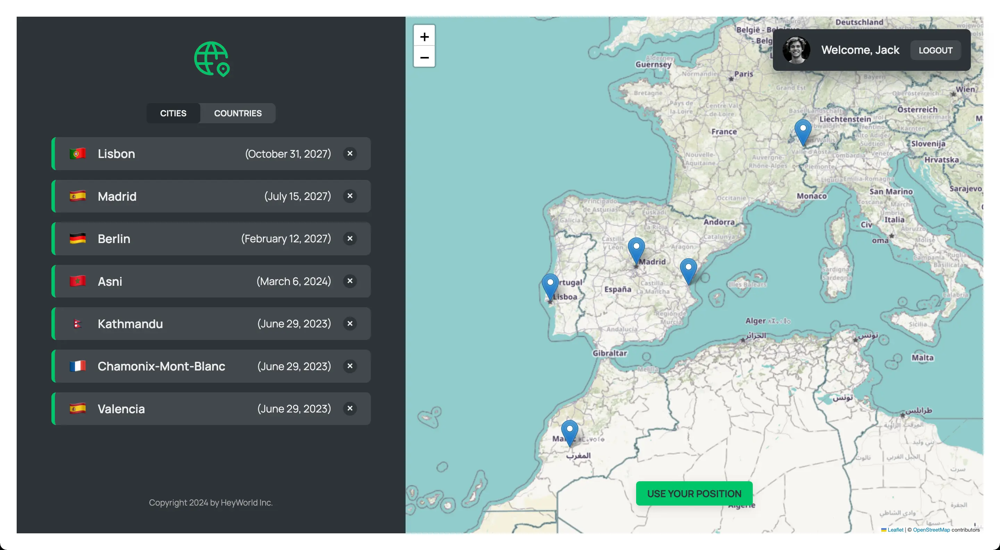

  
  <h1 style="color:#00c46a">HeyWorld</h1>

[HeyWorld](https://heyworld.mpondev.com/) is a MERN app to track the cities you visit, showing its locations on a map.

 

## ✨ Features

- View a list of the cities/countries you have tracked and their location on the map.
- Get city extra information (notes, link to Wikipedia city article, date info...) by clicking over it in the list.
- Add new cities by clicking them over the map or using your position.
- Delete cities you don't want to see again.
- Authentication. Fake login details (prefilled):
  - Email address: `jack@heyworld.com`
  - Password: `qwerty`

 

## 📦 Packages:

| Package                                                            | Description                                                                                                      |
| ------------------------------------------------------------------ | ---------------------------------------------------------------------------------------------------------------- |
| [compression](https://www.npmjs.com/package/compression)           | Node.js compression middleware.                                                                                  |
| [cors](https://www.npmjs.com/package/cors)                         | Node.js package for providing a Connect/Express middleware that can be used to enable CORS with various options. |
| [dotenv](https://www.npmjs.com/package/dotenv)                     | Zero-dependency module that loads environment variables from a .env file into process.env.                       |
| [json-server](https://www.npmjs.com/package/json-server)           | A full fake REST API with zero coding                                                                            |
| [leaflet](https://www.npmjs.com/package/leaflet)                   | An open-source JavaScript library for mobile-friendly interactive maps.                                          |
| [mongoose](https://www.npmjs.com/package/mongoose)                 | MongoDB object modeling tool designed to work in an asynchronous environment.                                    |
| [morgan](https://www.npmjs.com/package/morgan)                     | HTTP request logger middleware for node.js                                                                       |
| [prop-types](https://www.npmjs.com/package/prop-types)             | Runtime type checking for React props and similar objects.                                                       |
| [react-datepicker](https://www.npmjs.com/package/react-datepicker) | A simple and reusable Datepicker component for React.                                                            |
| [react-leaflet](https://www.npmjs.com/package/react-leaflet)       | React components for Leaflet maps                                                                                |

---

Based on [Jonas Schmedtmann](https://github.com/jonasschmedtmann) design, from [The Ultimate React Course 2023: React, Redux & More](https://www.udemy.com/course/the-ultimate-react-course/?couponCode=ST12MT030524)
